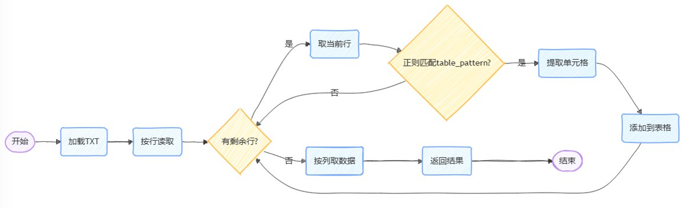
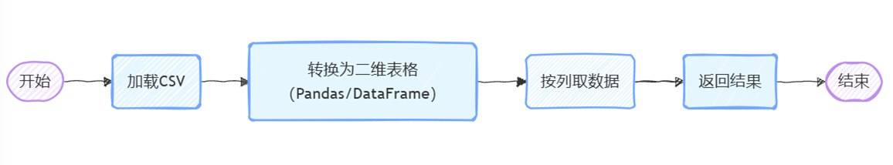
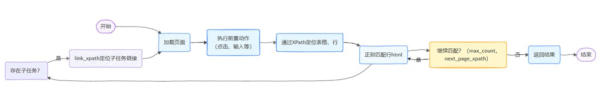
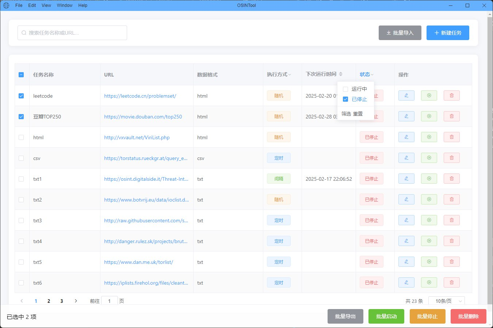
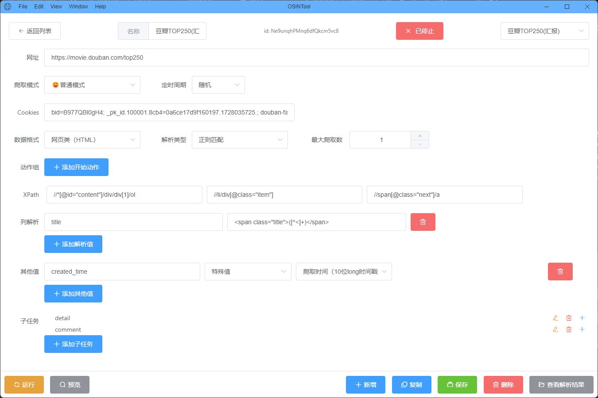

# 🔬 OSIN

📘 本 README 文件有  [English](README.md) | [中文](README.zh-CN.md)

## 📖 项目概述

**OSINTool** 是一款自动化网页爬取客户端，旨在高效收集和管理开源情报 (OSINT) 任务中的数据。该系统采用前后端分离的设计，桌面客户端使用 **Electron** 构建，后端服务器使用 **Flask 构建** 。

这种架构允许用户与用户友好的跨平台桌面界面进行交互，同时充分利用后端基于 Python 的异步抓取和调度功能。OSINTool 能够管理多个抓取任务，解析各种格式（HTML、CSV、TXT），调度定期抓取作业，并使用轻量级数据库在本地存储结果。

无论您执行数据聚合、内容监控还是开源调查，OSINTool 都为自动化重复的网络数据收集工作流程提供了模块化、可扩展的基础。

## 🚀 快速开始

### 安装依赖

在`frontend`目录下运行以下命令安装**前端依赖**：

```bash
npm install
```

在项目根目录下运行以下命令安装**后端依赖**：

```bash
pip install flask flask-cors flask[async] tinydb shortuuid requests lxml pandas aiofiles aiohttp apscheduler playwright
playwright install
```

### 启动前后端

在`根目录`启动**Flask后端**：

```bash
python app.py
```

在`frontend`目录启动**Electron客户端**：


```bash
npm start
```

> 请确保已经安装了 Playwright 所需的浏览器和驱动，可通过 `playwright install` 命令进行安装。


## 🧱 技术栈

基于**前后端分离**，构建 **Electron** **本地客户端**

### 前端

- 页面构建：HTML/CSS/JS
- 客户端开发：Electron
- 组件库：ElementUI

### 后端

- 本地服务器：Flask
- 数据爬取：Playwirght, Requests
- 定时任务：APSchedule
- 数据库：TinyDB


## 📁 项目结构

```
├── frontend
│   ├── edit.html 	 		# 编辑页
│   ├── index.html  			# 列表页
│   ├── main.js 			# Electron主进程
│   ├── package.json
│   ├── preload.js  			# 预加载脚本（含API）
├── utils
│   ├── parsers  			# 解析器
│   │   ├── base.py
│   │   ├── csv_parser.py
│   │   ├── html_parser.py
│   │   └── txt_parser.py
│   ├── common.py  			# 通用函数
│   ├── logger.py  			# 日志模块
│   ├── parser_factory.py  	        # 解析器工厂
├── app.py  				# Flask后端（含API）
├── db.json  				# TinyDB数据库
```


## 📊 解析器流程图

### TXTParser



### CSVParser



### HTMLParser



## 🖼️ 预览图

### 任务列表页（index.html）



### 任务编辑页（edit.html）




## ✅ Todo

- 支持CSV输出
- 处理OCR/滑动验证码等人机验证
- CI/CD
- 支持网页端部署


## 🧠 SWOT分析

- **Strengths（优势）**：支持多类型数据解析，自定义程度高 （登录、翻页等），任务调度灵活。
- **Weaknesses（劣势）**：学习成本高，需网页分析与正则基础；可视化差，没有直观界面；暂时无法应对人机验证等反爬技术。
- **Opportunities（机会）**：未来可融合AI实现智能爬取，集成如Excel等工具方便数据分析。
- **Threats（威胁）**：市场已有八爪鱼、EasySpider 等成熟可视化爬取工具；网页反爬技术迭代快 ，需持续更新爬取技术。


## 🔗 参考项目

- [八爪鱼采集器](https://www.bazhuayu.com/)
- [EasySpider](https://www.easyspider.net/)